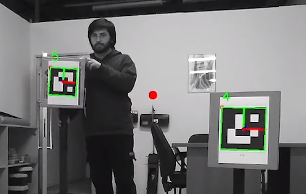
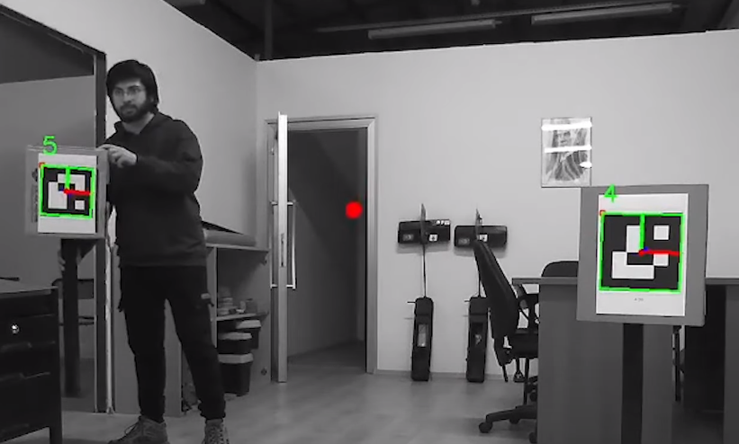

# Description
Zed stereo camera and OpenCV library are used to be able to detection of the ARUCO tags. For better recognition, Adaptive histogram equalization applied. Then blurred the images to remove other details for preprocessing on 1080p gray images.

## GTU Rover
This ROS package was made for use in the [GTU Rover](https://youtu.be/uv-LEvk_AX8?t=205) team's URC competition.  

# Screenshots

**Marker Detection - You can see the position information of the middle point of the marker on the right side.**   
   

  
**Between Point Detection - You can see the position of the between point of the markers as a red dot. Information of the position is also published as ROS topic**   
   

**Between Point Detection - You can see the position of the between point of the markers as a red dot. Information of the position is also published as ROS topic**    
